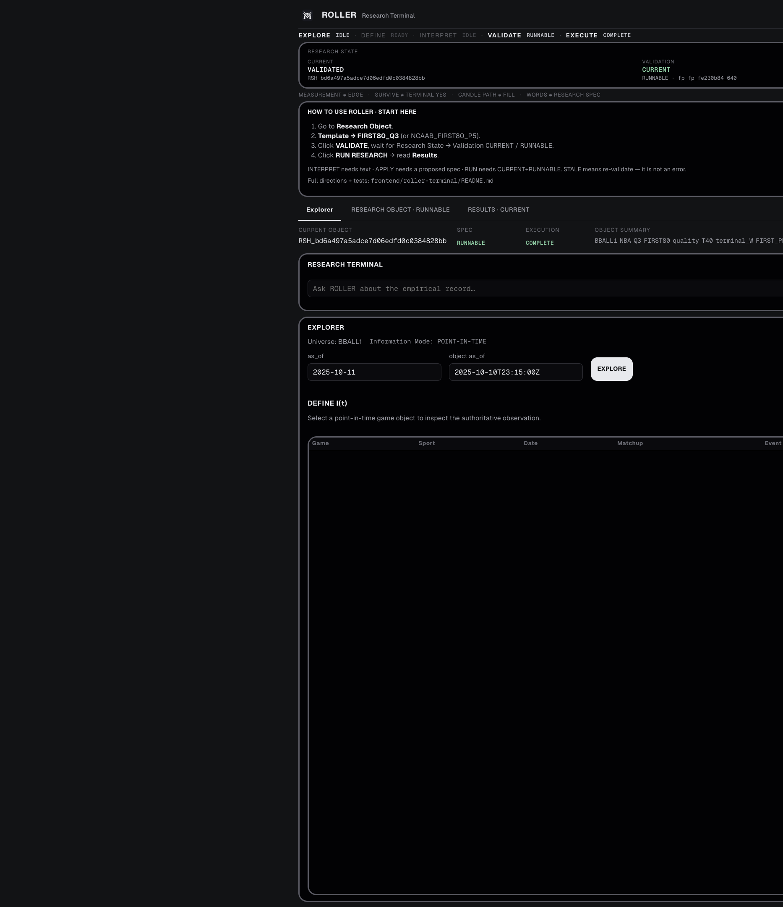
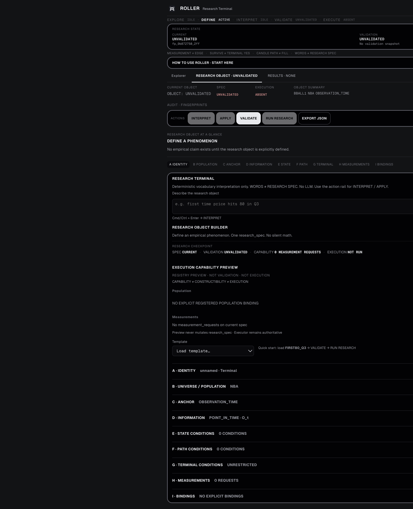
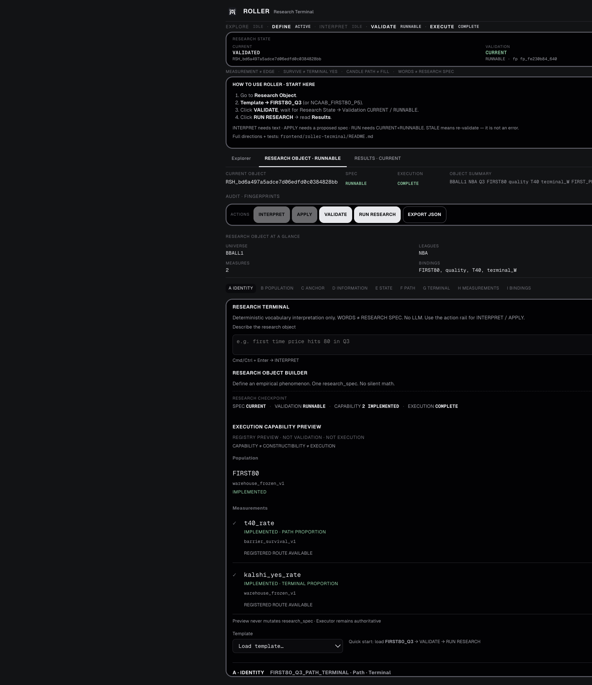
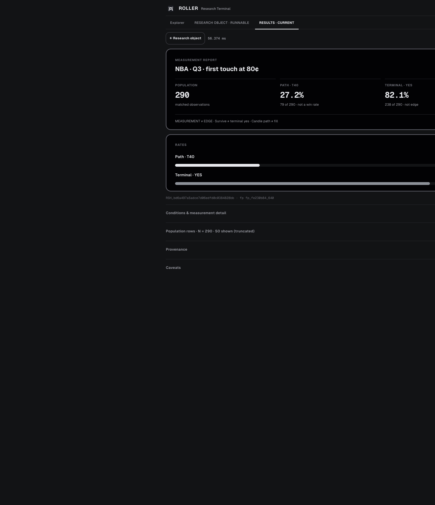

# ROLLER V1 — Full Summary for Development Team

**Audience:** engineers shipping or reviewing the Research Terminal  
**Scope:** product capabilities (Phases 0–6), non-goals, and the **V1 Visual System** shipped in `frontend/roller-terminal`  
**Date captured:** 2026-09-08  
**Not this doc:** warehouse rebuild report (`ROLLER/reports/ROLLER_V1_BUILD_REPORT.md`) — that covers data pipeline V1, not the Terminal UI

---

## One-line product definition

ROLLER Terminal is a **research OS** over frozen sports/market observations:

```text
WORDS → INTERPRET → research_spec → VALIDATE → RUN → measurements + provenance
```

It answers empirical questions about the record. It does **not** trade, size risk, or claim edge.

**Sans explains. Mono evidences.**

Canonical caveats (always true):

```text
MEASUREMENT ≠ EDGE
SURVIVE ≠ TERMINAL YES
CANDLE PATH ≠ FILL
WORDS ≠ RESEARCH SPEC
```

---

## Screenshots (live UI)

Captured against local UI `http://127.0.0.1:5179/` with API on `8791`.

### 1 — Explorer workspace

Point-in-time game discovery (`as_of` / object `as_of`), Research Terminal query box, Object Inspector placeholder until EXPLORE + game select.



### 2 — Research Object (blank / unvalidated)

Empty builder A–I, action rail with VALIDATE enabled, INTERPRET / APPLY / RUN gated.



### 3 — Research Object after FIRST80_Q3 + VALIDATE

Template loaded; Research State **CURRENT / RUNNABLE**; capability preview shows `t40_rate` + `kalshi_yes_rate` **IMPLEMENTED**.



### 4 — Results report (FIRST80_Q3 executed)

Dense report brief: headline question, N / T40% / YES%, rate bars. Population / provenance / caveats collapsed by default. Shell chrome (Research State, lifecycle, OperatorGuide) **hidden** on Results.



**Locked empirical readout for this run (must not “improve” in UI):**

| Field | Value |
|-------|--------|
| Population N | **290** |
| Path T40 | **~27.2%** (79 / 290) |
| Terminal YES | **~82.1%** (238 / 290) |
| Status | COMPLETE |

---

## What V1 can do

### Workspaces

| Workspace | Answers | Primary UI |
|-----------|---------|------------|
| **Explorer** | What existed at information set I(t)? | PIT query → game list → Object Inspector (authoritative O_t) |
| **Research Object** | What phenomenon am I defining? | Builder A–I + validate/preview + templates + vocabulary interpret |
| **Results** | What was actually measured? | Report brief + charts + collapsed evidence |

### Backend research stack (Phases 0–6)

| Phase | Capability | Notes |
|-------|------------|--------|
| 0 | Spec + FIRST80 reconciliation contract | Schema / authority; locks |
| 1 | Explorer + Object Inspector | Point-in-time; assemble can be slow first time |
| 2 | Research Object validate / preview / templates | Structural RO only in inspector pane |
| 3 | Vocabulary compiler | Deterministic **no LLM**; WORDS ≠ SPEC |
| 4 | Research executor | Bindings → population + measurements |
| 5 | Measurement registry | REGISTERED ≠ IMPLEMENTED |
| 6 | Population expansion | e.g. NCAAB_FIRST80_P5 (**n = 721**) when API process is on Phase 6 |

### Operator actions (Research Object)

| Action | Does | Requires |
|--------|------|----------|
| **INTERPRET** | Compiles terminal text → proposed_spec + gaps | Non-empty text |
| **APPLY** | Replaces current builder with proposed_spec | Successful interpret with `proposed_spec` |
| **VALIDATE** | Structural + capability validation snapshot | Always (unless in flight) |
| **RUN RESEARCH** | Executes against warehouse bindings | Validation **CURRENT** + **RUNNABLE** |
| **EXPORT JSON** | Downloads current research_spec | Spec present |

**STALE** after edit means re-validate — not an error.

### Golden path (exercise full stack today)

1. Research Object → Template **`FIRST80_Q3`**
2. **VALIDATE** → wait for Research State Validation **CURRENT / RUNNABLE**
3. **RUN RESEARCH** → Results (auto-switch on COMPLETE / PARTIAL)

Optional: type natural language → INTERPRET → APPLY → VALIDATE → RUN.  
**Hint text like `FIRST80_Q3` does not auto-load the template** — use the Template dropdown.

### Templates (code / docs)

Intended sample specs under `docs/research/roller_dashboard/samples/`:

- `FIRST80_Q3` — NBA Q3 FIRST80 path + terminal (**n = 290**)
- `NCAAB_FIRST80_P5` — NCAAB P5 FIRST80 (**n = 721**) when Phase 6 API is running
- Also: large-down-move / basis-extreme samples (partial / structural depending on bindings)

### Results UX (V1 report layout)

- **Headline** from leagues / slices / anchor (plain English; no invented edge)
- **Three metrics:** Population N · Path T40 · Terminal YES
- **Rate bars** (`ResultsCharts`) — proportions only
- Collapsed: conditions & measurement detail, population rows (truncated transport), provenance, caveats
- Does **not** invent EV, P&L, fill simulation, or “optimal report” claims beyond measured fields

### Visual / chrome behaviors

- Viewport-locked shell (`100dvh`, `overflow: hidden` on html/body/#root)
- Builder sections **A–I collapsed by default**; section index for jump
- Conditional mass on E/F/G when conditions exist (`.conditional-structure`)
- Audit fingerprints under collapsible on Research Object only
- Quiet lifecycle; demoted caveat strip; quiet nav vs actionable buttons
- Results hides OperatorGuide / Research State / lifecycle / context strip to maximize report

---

## What V1 cannot do (non-goals)

Do **not** invent or ship these under “just UI”:

| Non-goal | Why |
|----------|-----|
| Live trading / order entry / Kalshi submit | Different product hierarchy; Risk Decision Engine |
| Edge, EV, expected value, Kelly, sizing | MEASUREMENT ≠ EDGE |
| LLM interpretation | Vocabulary is deterministic |
| Phase 7 portfolio / cross-object systems | Explicitly unauthorized until approved |
| L2 order book / fill simulation | Candles = observation ≠ fill |
| W9 Greeks / live P&L / strategy retune | Research waterfall gate |
| Changing locked warehouse math to “look better” | Empirical locks are invariants |
| Auto-loading templates from interpret hints | Words ≠ template id |
| Claiming RESULTS when none executed | Shows empty / NONE — not a fabricated report |
| Silent recovery from inconsistent research state | Prefer STOP / STALE / re-validate |

**REGISTERED ≠ IMPLEMENTED.** Capability preview and registry may show routes that are not executable until bindings resolve.

---

## Visual system technicalities

### Design contract

| Token / rule | Value | Use |
|--------------|-------|-----|
| Canvas | `#121315` | Page background |
| Surface (box interiors) | `#020204` | Panels — charcoal, **not navy** |
| Surface raised | `#0a0a0e` | Raised / selected |
| Surface conditional | `#0e0e12` | Condition mass |
| Structural border | `#5a5a64` | Object outlines (~2px on research objects) |
| Subtle border | `#2e2e34` | Quiet dividers |
| Text primary / secondary / tertiary | `#e8e9ed` / `#9a9ba3` / `#6b6c74` | Hierarchy |
| OK / warn / bad | `#7dcea0` / `#d4b06a` / `#d88a8a` | Sparse status only |
| Radius scale (locked) | **6 / 10 / 14 / 18** px | control / action / object / conditional — **no intermediates** |
| Spacing scale | 4→64 px (`--s-1`…`--s-9`) | Rhythm |

Source of truth: `frontend/roller-terminal/src/styles.css` (`:root`).

### Typography (locked)

| Role | Family | Weight notes |
|------|--------|----------------|
| Explain (UI, titles, actions) | **Geist** (`--font-sans`) | Titles/actions often **700** |
| Evidence (hashes, rates, JSON, ids) | **Geist Mono** (`--font-mono`) | Mono for numbers that are claims |

Local files only (no CDN Inter/system chrome):

- `frontend/roller-terminal/public/fonts/geist-sans-latin-*.woff2`
- `frontend/roller-terminal/public/fonts/geist-mono-latin-*.woff2`
- Preloads in `index.html`

**Do not** reintroduce Inter / Roboto / system-ui preferred stacks for chrome.

### Brand

- Mark: `frontend/roller-terminal/public/brand/roller-mark-a3.png` (transparent plate)
- Header: mark + “ROLLER Research Terminal”

### Semantic CSS classes

| Class | Meaning |
|-------|---------|
| `.research-object` | Primary panel / object chrome |
| `.conditional-structure` | Condition mass (E/F/G); `.empty` when none |
| `.measurement-block` | Measurement evidence block |
| `.research-state` | Sole top status object (Current / Validation / Execution) |

### Key frontend modules

| Path | Responsibility |
|------|----------------|
| `src/App.tsx` | Shell, workspaces, chrome visibility |
| `src/ResearchObjectBuilder.tsx` | A–I builder, templates, validate/run |
| `src/ResultsView.tsx` | Results layout + collapsed evidence |
| `src/components/ResearchStatePanel.tsx` | Research State |
| `src/components/ResearchActionRail.tsx` | INTERPRET / APPLY / VALIDATE / RUN |
| `src/components/ResultsReportBrief.tsx` | Headline + N / T40 / YES |
| `src/components/ResultsCharts.tsx` | Rate bars |
| `src/components/OperatorGuide.tsx` | Golden path (hidden on Results) |
| `src/components/ResearchLifecycle.tsx` | Quiet EXPLORE→EXECUTE |
| `src/styles.css` | Graphite tokens + layout |

### Backend entry

| Path | Role |
|------|------|
| `ROLLER/scripts/terminal_api.py` | FastAPI terminal API (default **8791**) |
| Vite proxy | `/api/*` → API (UI **5179**) |

API routes are **unprefixed** on the process (`/health`, `/research-object-templates`, …). The browser calls `/api/...` via Vite rewrite.

---

## Runtime caveat (important for local demos)

**Repo source** (`terminal_api.py`) advertises **phase: 6** and Phase 6 population expansion.

A long-lived local process may still report **phase: 5** until restarted. Symptom: template list may omit `NCAAB_FIRST80_P5` even though docs/README mention it.

```bash
curl -s http://127.0.0.1:8791/health
# expect phase 6 after restart of scripts/terminal_api.py
```

Port **8791 already in use** usually means an older API is fine for FIRST80 — do **not** start a second process; restart that one if you need Phase 6.

Screenshots in this doc were taken with a **phase 5** process that still executed FIRST80_Q3 correctly (n=290).

---

## How to run

### API

```bash
cd /Users/user/Desktop/Momento/ROLLER
.venv/bin/pip install -e ".[terminal]"   # once
.venv/bin/python scripts/terminal_api.py
```

### UI

```bash
cd /Users/user/Desktop/Momento/frontend/roller-terminal
npm install   # once
npm run dev
```

Open **http://127.0.0.1:5179/**

Operator guide: `frontend/roller-terminal/README.md`

---

## Tests (regression)

Expect **63+** (non-integration):

```bash
cd /Users/user/Desktop/Momento/ROLLER
.venv/bin/python -m pytest -q \
  tests/test_research_spec_v0.py \
  tests/test_first80_reconciliation_phase0.py \
  tests/test_terminal_explorer_phase1.py \
  tests/test_research_object_phase2.py \
  tests/test_vocabulary_compiler_phase3.py \
  tests/test_research_executor_phase4.py \
  tests/test_measurement_registry_phase5.py \
  tests/test_population_expansion_phase6.py \
  -m "not integration"
```

Frontend:

```bash
cd /Users/user/Desktop/Momento/frontend/roller-terminal
npm run typecheck
```

**Empirical locks must not change:** FIRST80_Q3 **n=290**; NCAAB_FIRST80_P5 **n=721**.

---

## Related documents

| Doc | Role |
|-----|------|
| `frontend/roller-terminal/README.md` | Operator start / golden path / troubleshooting |
| `docs/research/roller_dashboard/RESEARCH_SPEC.md` | Spec contract |
| `docs/research/roller_dashboard/RESEARCH_OBJECT_MODEL.md` | Object model |
| `docs/research/roller_dashboard/AUTHORITY_MATRIX.md` | What may be called vs ABSENT |
| `docs/research/roller_dashboard/API_SURFACE_DRAFT.md` | API surface |
| `docs/research/roller_dashboard/samples/*.json` | Locked / sample research_specs |
| `ROLLER/reports/ROLLER_V1_BUILD_REPORT.md` | Warehouse / pipeline V1 (data layer) |

---

## Change control for the visual system

When changing chrome or Results:

1. Do not invent financial or edge semantics in copy or charts.
2. Keep Geist + radius + surface tokens; no navy fills.
3. Prefer densifying / collapsing over adding dashboard chrome.
4. Results remain evidence-first: N and measured rates before provenance walls.
5. Re-capture screenshots under `v1_screenshots/` if layout ships.
6. Do **not** start Phase 7 unless explicitly authorized.

---

## Stop line

Phases **0–6** + V1 visual system are the current research Terminal surface.  
**Do not start Phase 7** without authorization.
