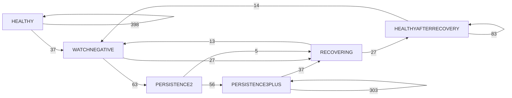
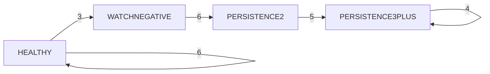

AUSTIN DRE
PHASE 3 — DOWNFALL STATE MODEL

RESEARCH ONLY

MODEL FROZEN
STATE SCHEMA FROZEN FOR V1
POLICY UNFROZEN
CONFIRMATION UNTOUCHED

HAZARD MODEL NOT BUILT
EXECUTION DISABLED

# 1. EXECUTIVE RESEARCH SUMMARY

Phase 3 assigns a deterministic PIT downfall state from observed Austin EV history.
It does not rewrite Phase 2. Phase 2 actionability remains NOT MET.
Confirmation was not read. No policy was selected. No hazard model was fit.
Gate A state validity: PASS
Gate B economic separation: MIXED
Gate C transition information: MIXED
Gate D timing / remaining damage: MIXED
Phase 4 decision: VALID STATE MODEL BUT NOT YET A USEFUL DRE PATH MODEL

# 2. PHASE IDENTITY

phase PHASE_3
phase_name DOWNFALL_STATE_MODEL
model_id AUSTIN_DOWNFALL_STATE_MODEL_V1
source_phase_2 AUSTIN_PERSISTENCE_MECHANISM_V1
state_schema_version downfall_state_v1
state_schema_hash 96018aec5e8d3da8374632ae139b0a25761b4d485da394a46b0f5e3159079307
phase_2_actionability_gate NOT_MET
phase_3_authorization EXPLICIT_RESEARCHER_AUTHORIZATION

# 3. PHASE-2 HANDOFF

Clock-order first-negative counts are copied, not recomputed:
A {'n_first_negative': 67, 'n_temporary': 51, 'n_persistent': 15, 'n_unresolved': 1}
B {'n_first_negative': 22, 'n_temporary': 5, 'n_persistent': 6, 'n_unresolved': 11}
Temporary / persistent labels remain future-derived Phase 2 outcomes.
They do not define Phase 3 PIT states.
Phase 2 report and statistics hashes were verified before this run.
phase_3_justified remains false. Acceptance remains: valid state diagnosis — not an actionable risk mechanism.

# 4. MODEL / COHORT LOCKS

model_manifest_hash 4a47bf9ad3a2fcd4bb092a77cf93d534e308423deec29e33b6e6bad85c76431c
feature_schema_hash ebd49948320720f7f8acb15ae46a03d5fc703c8c0f29a6be9e52f3d4442031ab
A_discovery_cohort_hash f7bc6280913c63a2a50cb5181b0c523c5492bbdb47da167d9639e2f867a87e36
A_confirmation_cohort_hash 4bc027bddba0f723b914b2d80e0ff49ae0eb0bff94711860e310737941e0f0e4
B_discovery_cohort_hash 699e6bb65fe4fa3dffc566b352f089c109ffadfb501b830e2c129f2e66450840
B_confirmation_cohort_hash 1ce8a0b2f3d3ee88d34cb0e4833cf3369aa776fc75bff912d7e2f3b2a4173c51
Confirmation hashes are identity only. Confirmation outcomes were not used.
bootstrap seed 80 B 1000 cluster internal_game_id

# 5. DOWNFALL STATE SCHEMA

version downfall_state_v1
states PRE_ENTRY HEALTHY WATCH_NEGATIVE PERSISTENCE_2 PERSISTENCE_3PLUS RECOVERING HEALTHY_AFTER_RECOVERY UNRESOLVED
gap_rule An unavailable/invalid PRIMARY checkpoint emits UNRESOLVED and breaks the streak. The next valid row starts a new segment: HEALTHY or WATCH_NEGATIVE. Recovery memory does not survive a gap. Persistence is never inferred across a gap.
Overlays do not modify core_state.
No CRITICAL / TERMINAL / FAILURE / EXIT.
schema_hash 96018aec5e8d3da8374632ae139b0a25761b4d485da394a46b0f5e3159079307

# 6. STATE ASSIGNMENT INTEGRITY

determinism PASS checked 165 failed 0
leakage PASS checked 80 failed 0
Assignment uses history through t only. Outcome keys are forbidden in derive_downfall_state.
Missing PRIMARY slots emit UNRESOLVED and break the streak.

# 7. STATE POPULATIONS

A and B are never pooled as a headline.

### A

| state | N rows | N first entries | pct discovery trades |
| --- | --- | --- | --- |
| HEALTHY | 471 | 68 | 0.7083 |
| WATCH_NEGATIVE | 95 | 67 | 0.6979 |
| PERSISTENCE_2 | 63 | 52 | 0.5417 |
| PERSISTENCE_3PLUS | 359 | 49 | 0.5104 |
| RECOVERING | 69 | 51 | 0.5312 |
| HEALTHY_AFTER_RECOVERY | 110 | 21 | 0.2188 |
| UNRESOLVED | 178 | 74 | 0.7708 |

### B

| state | N rows | N first entries | pct discovery trades |
| --- | --- | --- | --- |
| HEALTHY | 78 | 51 | 0.7391 |
| WATCH_NEGATIVE | 24 | 22 | 0.3188 |
| PERSISTENCE_2 | 6 | 6 | 0.0870 |
| PERSISTENCE_3PLUS | 9 | 5 | 0.0725 |
| RECOVERING | 0 | 0 | 0.0000 |
| HEALTHY_AFTER_RECOVERY | 0 | 0 | 0.0000 |
| UNRESOLVED | 429 | 69 | 1.0000 |

# 8. STATE ECONOMICS

First trade × state entry only. Subsequent PNL is hold-after-that-state, not a fill.

### A

| state | N | loss rate | mean PNL | T40 | MAE | MFE | recover>=80 |
| --- | --- | --- | --- | --- | --- | --- | --- |
| HEALTHY | 68 | 0.1324 | 6.7647 | 1.0000 | 13.6618 | 10.2647 | 0.9265 |
| WATCH_NEGATIVE | 67 | 0.2090 | -0.8955 | 1.0000 | 11.6818 | 15.2879 | 0.7879 |
| PERSISTENCE_2 | 52 | 0.1731 | 2.6923 | 0.9808 | 11.5800 | 12.8600 | 0.8000 |
| PERSISTENCE_3PLUS | 49 | 0.1633 | 3.6735 | 1.0000 | 11.2917 | 13.6250 | 0.8125 |
| RECOVERING | 51 | 0.1373 | 6.2745 | 0.9804 | 17.1613 | 9.9355 | 0.8387 |
| HEALTHY_AFTER_RECOVERY | 21 | 0.2381 | -3.8095 | 1.0000 | 20.7895 | 2.2105 | 0.6842 |
| UNRESOLVED | 74 | 0.1351 | 6.4865 | 1.0000 | 12.2027 | 27.5946 | 0.8784 |

### B

| state | N | loss rate | mean PNL | T40 | MAE | MFE | recover>=80 |
| --- | --- | --- | --- | --- | --- | --- | --- |
| HEALTHY | 51 | 0.0392 | 16.0784 | 0.9804 | 24.4074 | 5.5556 | 0.8519 |
| WATCH_NEGATIVE | 22 | 0.5455 | -34.5455 | 1.0000 | 17.7143 | 1.7857 | 0.3571 |
| PERSISTENCE_2 | 6 | 0.6667 | -46.6667 | 1.0000 | 0.0000 | 1.4000 | 0.0000 |
| PERSISTENCE_3PLUS | 5 | 0.6000 | -40.0000 | 1.0000 | 0.0000 | 3.5000 | 0.0000 |
| RECOVERING | 0 | UNAVAILABLE | UNAVAILABLE | UNAVAILABLE | UNAVAILABLE | UNAVAILABLE | UNAVAILABLE |
| HEALTHY_AFTER_RECOVERY | 0 | UNAVAILABLE | UNAVAILABLE | UNAVAILABLE | UNAVAILABLE | UNAVAILABLE | UNAVAILABLE |
| UNRESOLVED | 69 | 0.1739 | 2.6087 | 0.8986 | 8.3913 | 25.5362 | 0.7246 |

# 9. STATE ORDERING

Question: does HEALTHY → WATCH → PERSISTENCE_2 → PERSISTENCE_3PLUS show progressively worse subsequent economics?
A NOT_SUPPORTED monotonic=False REPORT NOT MONOTONIC
A by metric {'mean_pnl_hold_after_state': False, 'loss_rate': False, 'mean_future_MAE': False, 'mean_future_MFE': False, 'recover_ge_80': False}
B MIXED monotonic=False REPORT NOT MONOTONIC
B by metric {'mean_pnl_hold_after_state': False, 'loss_rate': False, 'mean_future_MAE': False, 'mean_future_MFE': False, 'recover_ge_80': True}

# 10. RECOVERY STATES

RECOVERING and HEALTHY_AFTER_RECOVERY are not depth ranks.
Compare them to PERSISTENCE_2 in the predeclared contrasts.

# 11. STATE CONTRASTS

Clustered bootstrap, internal_game_id, seed 80, B 1000. A and B separate.

### A

| contrast | metric | n_left | n_right | delta | class |
| --- | --- | --- | --- | --- | --- |
| WATCH_NEGATIVE vs HEALTHY | pnl | 67 | 68 | -7.6602 CI=[-14.8766, -1.0185] SUPPORTED | SUPPORTED |
| WATCH_NEGATIVE vs HEALTHY | loss_rate | 67 | 68 | 0.0766 CI=[0.0102, 0.1488] SUPPORTED | SUPPORTED |
| WATCH_NEGATIVE vs HEALTHY | mae | 67 | 68 | -1.9799 CI=[-9.1303, 4.8597] MIXED | MIXED |
| WATCH_NEGATIVE vs HEALTHY | mfe | 67 | 68 | 5.0232 CI=[1.5415, 9.4263] SUPPORTED | SUPPORTED |
| WATCH_NEGATIVE vs HEALTHY | recover_ge_80 | 67 | 68 | -0.1504 CI=[-0.2440, -0.0677] SUPPORTED | SUPPORTED |
| PERSISTENCE_2 vs WATCH_NEGATIVE | pnl | 52 | 67 | 3.5878 CI=[-2.0261, 10.0692] MIXED | MIXED |
| PERSISTENCE_2 vs WATCH_NEGATIVE | loss_rate | 52 | 67 | -0.0359 CI=[-0.1007, 0.0203] MIXED | MIXED |
| PERSISTENCE_2 vs WATCH_NEGATIVE | mae | 52 | 67 | -0.1018 CI=[-4.1165, 4.3258] MIXED | MIXED |
| PERSISTENCE_2 vs WATCH_NEGATIVE | mfe | 52 | 67 | -2.4279 CI=[-6.0467, 0.4329] MIXED | MIXED |
| PERSISTENCE_2 vs WATCH_NEGATIVE | recover_ge_80 | 52 | 67 | -0.0069 CI=[-0.0789, 0.0614] MIXED | MIXED |
| PERSISTENCE_3PLUS vs PERSISTENCE_2 | pnl | 49 | 52 | 0.9812 CI=[-1.4423, 4.9679] MIXED | MIXED |
| PERSISTENCE_3PLUS vs PERSISTENCE_2 | loss_rate | 49 | 52 | -0.0098 CI=[-0.0497, 0.0144] MIXED | MIXED |
| PERSISTENCE_3PLUS vs PERSISTENCE_2 | mae | 49 | 52 | -0.2883 CI=[-1.4143, 0.6637] MIXED | MIXED |
| PERSISTENCE_3PLUS vs PERSISTENCE_2 | mfe | 49 | 52 | 0.7650 CI=[0.1398, 1.6562] SUPPORTED | SUPPORTED |
| PERSISTENCE_3PLUS vs PERSISTENCE_2 | recover_ge_80 | 49 | 52 | 0.0267 CI=[-0.0053, 0.0716] MIXED | MIXED |
| RECOVERING vs PERSISTENCE_2 | pnl | 51 | 52 | 3.5822 CI=[-6.9327, 14.1745] MIXED | MIXED |
| RECOVERING vs PERSISTENCE_2 | loss_rate | 51 | 52 | -0.0358 CI=[-0.1417, 0.0693] MIXED | MIXED |
| RECOVERING vs PERSISTENCE_2 | mae | 51 | 52 | 5.5813 CI=[-6.5263, 16.5966] MIXED | MIXED |
| RECOVERING vs PERSISTENCE_2 | mfe | 51 | 52 | -2.9245 CI=[-8.8675, 3.3095] MIXED | MIXED |
| RECOVERING vs PERSISTENCE_2 | recover_ge_80 | 51 | 52 | -0.2594 CI=[-0.4432, -0.0764] SUPPORTED | SUPPORTED |
| HEALTHY_AFTER_RECOVERY vs PERSISTENCE_2 | pnl | 21 | 52 | -6.5018 CI=[-26.5313, 12.7103] MIXED | MIXED |
| HEALTHY_AFTER_RECOVERY vs PERSISTENCE_2 | loss_rate | 21 | 52 | 0.0650 CI=[-0.1271, 0.2653] MIXED | MIXED |
| HEALTHY_AFTER_RECOVERY vs PERSISTENCE_2 | mae | 21 | 52 | 9.2095 CI=[-4.0309, 22.1266] MIXED | MIXED |
| HEALTHY_AFTER_RECOVERY vs PERSISTENCE_2 | mfe | 21 | 52 | -10.6495 CI=[-21.4427, -1.6944] SUPPORTED | SUPPORTED |
| HEALTHY_AFTER_RECOVERY vs PERSISTENCE_2 | recover_ge_80 | 21 | 52 | -0.1502 CI=[-0.3715, 0.0833] MIXED | MIXED |

### B

| contrast | metric | n_left | n_right | delta | class |
| --- | --- | --- | --- | --- | --- |
| WATCH_NEGATIVE vs HEALTHY | pnl | 22 | 51 | -50.6239 CI=[-72.7790, -30.4276] SUPPORTED | SUPPORTED |
| WATCH_NEGATIVE vs HEALTHY | loss_rate | 22 | 51 | 0.5062 CI=[0.3043, 0.7278] SUPPORTED | SUPPORTED |
| WATCH_NEGATIVE vs HEALTHY | mae | 22 | 51 | -6.6931 CI=[-17.4552, 5.9879] MIXED | MIXED |
| WATCH_NEGATIVE vs HEALTHY | mfe | 22 | 51 | -3.7698 CI=[-13.4898, 5.9420] MIXED | MIXED |
| WATCH_NEGATIVE vs HEALTHY | recover_ge_80 | 22 | 51 | -0.2237 CI=[-0.4572, -0.0068] SUPPORTED | SUPPORTED |
| PERSISTENCE_2 vs WATCH_NEGATIVE | pnl | 6 | 22 | -12.1212 CI=[-50.0000, 25.4621] MIXED | MIXED |
| PERSISTENCE_2 vs WATCH_NEGATIVE | loss_rate | 6 | 22 | 0.1212 CI=[-0.2546, 0.5000] MIXED | MIXED |
| PERSISTENCE_2 vs WATCH_NEGATIVE | mae | 6 | 22 | -17.7143 CI=[-29.9429, -8.2786] SUPPORTED | SUPPORTED |
| PERSISTENCE_2 vs WATCH_NEGATIVE | mfe | 6 | 22 | -0.3857 CI=[-9.8786, 9.1071] MIXED | MIXED |
| PERSISTENCE_2 vs WATCH_NEGATIVE | recover_ge_80 | 6 | 22 | -0.2273 CI=[-0.4091, -0.0455] SUPPORTED | SUPPORTED |
| PERSISTENCE_3PLUS vs PERSISTENCE_2 | pnl | 5 | 6 | 6.6667 CI=[0.0000, 33.3333] MIXED | MIXED |
| PERSISTENCE_3PLUS vs PERSISTENCE_2 | loss_rate | 5 | 6 | -0.0667 CI=[-0.3333, 0.0000] MIXED | MIXED |
| PERSISTENCE_3PLUS vs PERSISTENCE_2 | mae | 5 | 6 | 0.0000 CI=[0.0000, 0.0000] MIXED | MIXED |
| PERSISTENCE_3PLUS vs PERSISTENCE_2 | mfe | 5 | 6 | 2.1000 CI=[0.0000, 5.6000] MIXED | MIXED |
| PERSISTENCE_3PLUS vs PERSISTENCE_2 | recover_ge_80 | 5 | 6 | 0.0000 CI=[0.0000, 0.0000] MIXED | MIXED |
| RECOVERING vs PERSISTENCE_2 | pnl | 0 | 6 | UNAVAILABLE CI=[UNAVAILABLE, UNAVAILABLE] INSUFFICIENT_SAMPLE | INSUFFICIENT_SAMPLE |
| RECOVERING vs PERSISTENCE_2 | loss_rate | 0 | 6 | UNAVAILABLE CI=[UNAVAILABLE, UNAVAILABLE] INSUFFICIENT_SAMPLE | INSUFFICIENT_SAMPLE |
| RECOVERING vs PERSISTENCE_2 | mae | 0 | 6 | UNAVAILABLE CI=[UNAVAILABLE, UNAVAILABLE] INSUFFICIENT_SAMPLE | INSUFFICIENT_SAMPLE |
| RECOVERING vs PERSISTENCE_2 | mfe | 0 | 6 | UNAVAILABLE CI=[UNAVAILABLE, UNAVAILABLE] INSUFFICIENT_SAMPLE | INSUFFICIENT_SAMPLE |
| RECOVERING vs PERSISTENCE_2 | recover_ge_80 | 0 | 6 | UNAVAILABLE CI=[UNAVAILABLE, UNAVAILABLE] INSUFFICIENT_SAMPLE | INSUFFICIENT_SAMPLE |
| HEALTHY_AFTER_RECOVERY vs PERSISTENCE_2 | pnl | 0 | 6 | UNAVAILABLE CI=[UNAVAILABLE, UNAVAILABLE] INSUFFICIENT_SAMPLE | INSUFFICIENT_SAMPLE |
| HEALTHY_AFTER_RECOVERY vs PERSISTENCE_2 | loss_rate | 0 | 6 | UNAVAILABLE CI=[UNAVAILABLE, UNAVAILABLE] INSUFFICIENT_SAMPLE | INSUFFICIENT_SAMPLE |
| HEALTHY_AFTER_RECOVERY vs PERSISTENCE_2 | mae | 0 | 6 | UNAVAILABLE CI=[UNAVAILABLE, UNAVAILABLE] INSUFFICIENT_SAMPLE | INSUFFICIENT_SAMPLE |
| HEALTHY_AFTER_RECOVERY vs PERSISTENCE_2 | mfe | 0 | 6 | UNAVAILABLE CI=[UNAVAILABLE, UNAVAILABLE] INSUFFICIENT_SAMPLE | INSUFFICIENT_SAMPLE |
| HEALTHY_AFTER_RECOVERY vs PERSISTENCE_2 | recover_ge_80 | 0 | 6 | UNAVAILABLE CI=[UNAVAILABLE, UNAVAILABLE] INSUFFICIENT_SAMPLE | INSUFFICIENT_SAMPLE |

# 12. STATE TRANSITION GRAPH

Adjacent valid PRIMARY rows only. No interpolated edges.

### A

A observed adjacent valid PRIMARY counts only. Not a hazard.

### B

B observed adjacent valid PRIMARY counts only. Not a hazard.

# 13. TRANSITION MATRIX

Conditional frequencies are descriptive. They are not a loss hazard.

### A nonzero

| from | to | count | frequency |
| --- | --- | --- | --- |
| HEALTHY | HEALTHY | 398 | 0.9149 |
| HEALTHY | WATCH_NEGATIVE | 37 | 0.0851 |
| WATCH_NEGATIVE | PERSISTENCE_2 | 63 | 0.7000 |
| WATCH_NEGATIVE | RECOVERING | 27 | 0.3000 |
| PERSISTENCE_2 | PERSISTENCE_3PLUS | 56 | 0.9180 |
| PERSISTENCE_2 | RECOVERING | 5 | 0.0820 |
| PERSISTENCE_3PLUS | PERSISTENCE_3PLUS | 303 | 0.8912 |
| PERSISTENCE_3PLUS | RECOVERING | 37 | 0.1088 |
| RECOVERING | WATCH_NEGATIVE | 13 | 0.3250 |
| RECOVERING | HEALTHY_AFTER_RECOVERY | 27 | 0.6750 |
| HEALTHY_AFTER_RECOVERY | WATCH_NEGATIVE | 14 | 0.1443 |
| HEALTHY_AFTER_RECOVERY | HEALTHY_AFTER_RECOVERY | 83 | 0.8557 |

### B nonzero

| from | to | count | frequency |
| --- | --- | --- | --- |
| HEALTHY | HEALTHY | 6 | 0.6667 |
| HEALTHY | WATCH_NEGATIVE | 3 | 0.3333 |
| WATCH_NEGATIVE | PERSISTENCE_2 | 6 | 1.0000 |
| PERSISTENCE_2 | PERSISTENCE_3PLUS | 5 | 1.0000 |
| PERSISTENCE_3PLUS | PERSISTENCE_3PLUS | 4 | 1.0000 |

# 14. TRANSITION ECONOMICS

First occurrence per trade of the four required branches.

### A

| transition | N | loss rate | mean PNL | T40 | MAE | MFE | recover>=80 |
| --- | --- | --- | --- | --- | --- | --- | --- |
| WATCH_NEGATIVE → RECOVERING | 20 | 0.2500 | -5.0000 | 1.0000 | 17.9000 | 9.9000 | 0.7500 |
| WATCH_NEGATIVE → PERSISTENCE_2 | 52 | 0.1731 | 2.6923 | 0.9808 | 11.5800 | 12.8600 | 0.8000 |
| PERSISTENCE_2 → RECOVERING | 5 | 0.0000 | 20.0000 | 1.0000 | -2.2000 | 22.2000 | 1.0000 |
| PERSISTENCE_2 → PERSISTENCE_3PLUS | 49 | 0.1633 | 3.6735 | 1.0000 | 11.2917 | 13.6250 | 0.8125 |

| branch contrast | metric | n_left | n_right | delta | class |
| --- | --- | --- | --- | --- | --- |
| WATCH_NEGATIVE → RECOVERING vs WATCH_NEGATIVE → PERSISTENCE_2 | pnl | 20 | 52 | -7.6923 CI=[-28.0244, 12.3020] MIXED | MIXED |
| WATCH_NEGATIVE → RECOVERING vs WATCH_NEGATIVE → PERSISTENCE_2 | loss_rate | 20 | 52 | 0.0769 CI=[-0.1230, 0.2802] MIXED | MIXED |
| PERSISTENCE_2 → RECOVERING vs PERSISTENCE_2 → PERSISTENCE_3PLUS | pnl | 5 | 49 | 16.3265 CI=[7.7413, 27.0833] SUPPORTED | SUPPORTED |
| PERSISTENCE_2 → RECOVERING vs PERSISTENCE_2 → PERSISTENCE_3PLUS | loss_rate | 5 | 49 | -0.1633 CI=[-0.2708, -0.0774] SUPPORTED | SUPPORTED |

### B

| transition | N | loss rate | mean PNL | T40 | MAE | MFE | recover>=80 |
| --- | --- | --- | --- | --- | --- | --- | --- |
| WATCH_NEGATIVE → RECOVERING | 0 | UNAVAILABLE | UNAVAILABLE | UNAVAILABLE | UNAVAILABLE | UNAVAILABLE | UNAVAILABLE |
| WATCH_NEGATIVE → PERSISTENCE_2 | 6 | 0.6667 | -46.6667 | 1.0000 | 0.0000 | 1.4000 | 0.0000 |
| PERSISTENCE_2 → RECOVERING | 0 | UNAVAILABLE | UNAVAILABLE | UNAVAILABLE | UNAVAILABLE | UNAVAILABLE | UNAVAILABLE |
| PERSISTENCE_2 → PERSISTENCE_3PLUS | 5 | 0.6000 | -40.0000 | 1.0000 | 0.0000 | 3.5000 | 0.0000 |

| branch contrast | metric | n_left | n_right | delta | class |
| --- | --- | --- | --- | --- | --- |
| WATCH_NEGATIVE → RECOVERING vs WATCH_NEGATIVE → PERSISTENCE_2 | pnl | 0 | 6 | UNAVAILABLE CI=[UNAVAILABLE, UNAVAILABLE] INSUFFICIENT_SAMPLE | INSUFFICIENT_SAMPLE |
| WATCH_NEGATIVE → RECOVERING vs WATCH_NEGATIVE → PERSISTENCE_2 | loss_rate | 0 | 6 | UNAVAILABLE CI=[UNAVAILABLE, UNAVAILABLE] INSUFFICIENT_SAMPLE | INSUFFICIENT_SAMPLE |
| PERSISTENCE_2 → RECOVERING vs PERSISTENCE_2 → PERSISTENCE_3PLUS | pnl | 0 | 5 | UNAVAILABLE CI=[UNAVAILABLE, UNAVAILABLE] INSUFFICIENT_SAMPLE | INSUFFICIENT_SAMPLE |
| PERSISTENCE_2 → RECOVERING vs PERSISTENCE_2 → PERSISTENCE_3PLUS | loss_rate | 0 | 5 | UNAVAILABLE CI=[UNAVAILABLE, UNAVAILABLE] INSUFFICIENT_SAMPLE | INSUFFICIENT_SAMPLE |

# 15. PATH ARCHETYPES

Mutually exclusive first-match labels. Not ranked. No winner or loser path names.

### A

| archetype | N | loss rate | mean PNL | T40 | MAE | MFE | recover>=80 |
| --- | --- | --- | --- | --- | --- | --- | --- |
| STABLE_HEALTHY | 29 | 0.0345 | 16.5517 | 1.0000 | -2.4138 | 36.8621 | 0.9655 |
| SINGLE_NEGATIVE_RECOVERY | 14 | 0.2857 | -8.5714 | 1.0000 | 11.0714 | 18.8571 | 0.7857 |
| NEGATIVE_TO_RECOVERY | 0 | UNAVAILABLE | UNAVAILABLE | UNAVAILABLE | UNAVAILABLE | UNAVAILABLE | UNAVAILABLE |
| NEGATIVE_TO_PERSISTENCE_2 | 1 | 0.0000 | 20.0000 | 1.0000 | 0.0000 | 0.0000 | 0.0000 |
| NEGATIVE_TO_PERSISTENCE_3PLUS | 14 | 0.4286 | -22.8571 | 1.0000 | 21.5000 | 1.7857 | 0.4286 |
| PERSISTENCE_TO_RECOVERY | 37 | 0.0811 | 11.8919 | 1.0000 | 8.5135 | 19.4595 | 0.9459 |
| UNRESOLVED_PATH | 1 | 1.0000 | -80.0000 | 1.0000 | UNAVAILABLE | UNAVAILABLE | UNAVAILABLE |

### B

| archetype | N | loss rate | mean PNL | T40 | MAE | MFE | recover>=80 |
| --- | --- | --- | --- | --- | --- | --- | --- |
| STABLE_HEALTHY | 41 | 0.0000 | 20.0000 | 0.9756 | 2.6829 | 32.8049 | 0.9756 |
| SINGLE_NEGATIVE_RECOVERY | 0 | UNAVAILABLE | UNAVAILABLE | UNAVAILABLE | UNAVAILABLE | UNAVAILABLE | UNAVAILABLE |
| NEGATIVE_TO_RECOVERY | 0 | UNAVAILABLE | UNAVAILABLE | UNAVAILABLE | UNAVAILABLE | UNAVAILABLE | UNAVAILABLE |
| NEGATIVE_TO_PERSISTENCE_2 | 1 | 1.0000 | -80.0000 | 1.0000 | 14.0000 | -14.0000 | 0.0000 |
| NEGATIVE_TO_PERSISTENCE_3PLUS | 5 | 0.6000 | -40.0000 | 1.0000 | 19.8000 | -3.4000 | 0.0000 |
| PERSISTENCE_TO_RECOVERY | 0 | UNAVAILABLE | UNAVAILABLE | UNAVAILABLE | UNAVAILABLE | UNAVAILABLE | UNAVAILABLE |
| UNRESOLVED_PATH | 22 | 0.3636 | -16.3636 | 0.7273 | 9.6429 | 4.0000 | 0.3571 |

# 16. STATE DEPTH

Research ordinal only: HEALTHY 0, WATCH 1, PERSISTENCE_2 2, PERSISTENCE_3PLUS 3.
A economically ordered False STATE DEPTH NOT ECONOMICALLY ORDERED
B economically ordered False STATE DEPTH NOT ECONOMICALLY ORDERED

| member | state | depth | N | loss | mean PNL |
| --- | --- | --- | --- | --- | --- |
| A | HEALTHY | 0 | 68 | 0.1324 | 6.7647 |
| A | WATCH_NEGATIVE | 1 | 67 | 0.2090 | -0.8955 |
| A | PERSISTENCE_2 | 2 | 52 | 0.1731 | 2.6923 |
| A | PERSISTENCE_3PLUS | 3 | 49 | 0.1633 | 3.6735 |
| B | HEALTHY | 0 | 51 | 0.0392 | 16.0784 |
| B | WATCH_NEGATIVE | 1 | 22 | 0.5455 | -34.5455 |
| B | PERSISTENCE_2 | 2 | 6 | 0.6667 | -46.6667 |
| B | PERSISTENCE_3PLUS | 3 | 5 | 0.6000 | -40.0000 |

# 17. CI OVERLAY

CI_CROSSES_ZERO vs CI_NEGATIVE inside each core state. Overlay does not change core_state.

| member | state | n neg | n cross | delta | class |
| --- | --- | --- | --- | --- | --- |
| A | HEALTHY | 0 | 11 | UNAVAILABLE CI=[UNAVAILABLE, UNAVAILABLE] INSUFFICIENT_SAMPLE | INSUFFICIENT_SAMPLE |
| A | WATCH_NEGATIVE | 32 | 35 | -13.8393 CI=[-32.5960, 4.4649] MIXED | MIXED |
| A | PERSISTENCE_2 | 16 | 36 | -29.1667 CI=[-55.7628, -3.7594] SUPPORTED | SUPPORTED |
| A | PERSISTENCE_3PLUS | 13 | 36 | -30.1282 CI=[-58.8452, -2.3888] SUPPORTED | SUPPORTED |
| A | RECOVERING | 0 | 24 | UNAVAILABLE CI=[UNAVAILABLE, UNAVAILABLE] INSUFFICIENT_SAMPLE | INSUFFICIENT_SAMPLE |
| A | HEALTHY_AFTER_RECOVERY | 0 | 16 | UNAVAILABLE CI=[UNAVAILABLE, UNAVAILABLE] INSUFFICIENT_SAMPLE | INSUFFICIENT_SAMPLE |
| A | UNRESOLVED | 0 | 0 | UNAVAILABLE CI=[UNAVAILABLE, UNAVAILABLE] INSUFFICIENT_SAMPLE | INSUFFICIENT_SAMPLE |
| B | HEALTHY | 0 | 20 | UNAVAILABLE CI=[UNAVAILABLE, UNAVAILABLE] INSUFFICIENT_SAMPLE | INSUFFICIENT_SAMPLE |
| B | WATCH_NEGATIVE | 16 | 6 | -52.0833 CI=[-84.6250, -6.9984] SUPPORTED | SUPPORTED |
| B | PERSISTENCE_2 | 5 | 1 | 40.0000 CI=[0.0000, 80.0000] INSUFFICIENT_SAMPLE | INSUFFICIENT_SAMPLE |
| B | PERSISTENCE_3PLUS | 4 | 1 | 50.0000 CI=[0.0000, 100.0000] INSUFFICIENT_SAMPLE | INSUFFICIENT_SAMPLE |
| B | RECOVERING | 0 | 0 | UNAVAILABLE CI=[UNAVAILABLE, UNAVAILABLE] INSUFFICIENT_SAMPLE | INSUFFICIENT_SAMPLE |
| B | HEALTHY_AFTER_RECOVERY | 0 | 0 | UNAVAILABLE CI=[UNAVAILABLE, UNAVAILABLE] INSUFFICIENT_SAMPLE | INSUFFICIENT_SAMPLE |
| B | UNRESOLVED | 0 | 0 | UNAVAILABLE CI=[UNAVAILABLE, UNAVAILABLE] INSUFFICIENT_SAMPLE | INSUFFICIENT_SAMPLE |

# 18. SUPPORT / MANIFOLD

LOW_HISTORICAL_SUPPORT rows remain included. Threshold 2.5 was not refit.

| member | state | N | low-support rate | mean ESS | median distance |
| --- | --- | --- | --- | --- | --- |
| A | HEALTHY | 68 | 0.0294 | 24.8086 | 1.0024 |
| A | WATCH_NEGATIVE | 67 | 0.0000 | 24.7178 | 1.1718 |
| A | PERSISTENCE_2 | 52 | 0.0000 | 24.7998 | 1.4811 |
| A | PERSISTENCE_3PLUS | 49 | 0.0000 | 24.8229 | 1.5153 |
| A | RECOVERING | 51 | 0.0196 | 24.5758 | 1.0914 |
| A | HEALTHY_AFTER_RECOVERY | 21 | 0.0000 | 24.8506 | 1.3962 |
| A | UNRESOLVED | 74 | 0.0000 | UNAVAILABLE | UNAVAILABLE |
| B | HEALTHY | 51 | 0.0000 | 24.2336 | 0.7899 |
| B | WATCH_NEGATIVE | 22 | 0.0000 | 23.5505 | 1.0526 |
| B | PERSISTENCE_2 | 6 | 0.0000 | 23.6824 | 1.0811 |
| B | PERSISTENCE_3PLUS | 5 | 0.0000 | 23.6853 | 0.9485 |
| B | RECOVERING | 0 | UNAVAILABLE | UNAVAILABLE | UNAVAILABLE |
| B | HEALTHY_AFTER_RECOVERY | 0 | UNAVAILABLE | UNAVAILABLE | UNAVAILABLE |
| B | UNRESOLVED | 69 | 0.0000 | UNAVAILABLE | UNAVAILABLE |

# 19. MARKET DAMAGE AT STATE ENTRY

Price and score are context. They do not define core_state.

| member | state | mean price | mean price travel | mean adverse remaining |
| --- | --- | --- | --- | --- |
| A | WATCH_NEGATIVE | 74.3134 | -7.6716 | 11.6818 |
| A | PERSISTENCE_2 | 76.1154 | -5.9615 | 11.5800 |
| A | PERSISTENCE_3PLUS | 76.3673 | -5.7347 | 11.2917 |
| A | RECOVERING | 88.4706 | 6.4706 | 17.1613 |
| B | WATCH_NEGATIVE | 52.7273 | -29.4091 | 17.7143 |
| B | PERSISTENCE_2 | 33.8333 | -48.3333 | 0.0000 |
| B | PERSISTENCE_3PLUS | 37.6000 | -44.6000 | 0.0000 |
| B | RECOVERING | UNAVAILABLE | UNAVAILABLE | UNAVAILABLE |

# 20. INTERVENTION WINDOW REMAINING

Descriptive remaining damage only. Not an instruction.

| member | state | N | mean adverse ¢ | mean minutes to worst | mean minutes to settlement |
| --- | --- | --- | --- | --- | --- |
| A | WATCH_NEGATIVE | 67 | 11.6818 | 5.0149 | 17.7612 |
| A | PERSISTENCE_2 | 52 | 11.5800 | 4.2308 | 16.7692 |
| A | PERSISTENCE_3PLUS | 49 | 11.2917 | 3.5918 | 15.1020 |
| A | RECOVERING | 51 | 17.1613 | 3.0196 | 8.0392 |
| B | WATCH_NEGATIVE | 22 | 17.7143 | 1.3636 | 3.7727 |
| B | PERSISTENCE_2 | 6 | 0.0000 | 0.0000 | 3.1667 |
| B | PERSISTENCE_3PLUS | 5 | 0.0000 | 0.0000 | 1.8000 |
| B | RECOVERING | 0 | UNAVAILABLE | UNAVAILABLE | UNAVAILABLE |

# 21. STATE TIMING

STATE TIMING is not validated early warning.
Phase 1 AVAILABLE warning among eventual losses remains A = 0 / 15 and B = 0 / 12.

| member | state | result | N | minutes to T40 | minutes to worst | adverse ¢ |
| --- | --- | --- | --- | --- | --- | --- |
| A | WATCH_NEGATIVE | WIN | 53 | 0.1132 | 2.8302 | 4.4151 |
| A | WATCH_NEGATIVE | LOSS | 14 | 0.0000 | 13.2857 | 41.3077 |
| A | PERSISTENCE_2 | WIN | 43 | 0.0952 | 2.5116 | 4.6667 |
| A | PERSISTENCE_2 | LOSS | 9 | 0.0000 | 12.4444 | 47.8750 |
| A | PERSISTENCE_3PLUS | WIN | 41 | 0.0976 | 1.8537 | 3.8780 |
| A | PERSISTENCE_3PLUS | LOSS | 8 | 0.0000 | 12.5000 | 54.7143 |
| A | RECOVERING | WIN | 44 | 0.0930 | 1.4091 | 5.0417 |
| A | RECOVERING | LOSS | 7 | 0.0000 | 13.1429 | 58.7143 |
| A | HEALTHY_AFTER_RECOVERY | WIN | 16 | 0.2500 | 2.2500 | 10.9286 |
| A | HEALTHY_AFTER_RECOVERY | LOSS | 5 | 0.0000 | 10.4000 | 48.4000 |
| B | WATCH_NEGATIVE | WIN | 10 | 0.0000 | 1.0000 | 13.2500 |
| B | WATCH_NEGATIVE | LOSS | 12 | 0.0000 | 1.6667 | 23.6667 |
| B | PERSISTENCE_2 | WIN | 2 | 0.0000 | 0.0000 | 0.0000 |
| B | PERSISTENCE_2 | LOSS | 4 | 0.0000 | 0.0000 | 0.0000 |
| B | PERSISTENCE_3PLUS | WIN | 2 | 0.0000 | 0.0000 | 0.0000 |
| B | PERSISTENCE_3PLUS | LOSS | 3 | 0.0000 | 0.0000 | 0.0000 |
| B | RECOVERING | WIN | 0 | UNAVAILABLE | UNAVAILABLE | UNAVAILABLE |
| B | RECOVERING | LOSS | 0 | UNAVAILABLE | UNAVAILABLE | UNAVAILABLE |
| B | HEALTHY_AFTER_RECOVERY | WIN | 0 | UNAVAILABLE | UNAVAILABLE | UNAVAILABLE |
| B | HEALTHY_AFTER_RECOVERY | LOSS | 0 | UNAVAILABLE | UNAVAILABLE | UNAVAILABLE |

# 22. H2_1 ALIGNMENT STATUS

status EXPECTED_FROM_CANONICAL_TIMING
potential_data_alignment_defect False
n_clock_wall_mismatch 61
n_aligned 8
Copied from Phase 2. Timestamps were not repaired.

# 23. STATISTICAL UNCERTAINTY

Clustered bootstrap by internal_game_id. Seed 80. B 1000.
Small first-entry cells stay INSUFFICIENT_SAMPLE. They are not filled.
A and B are never combined into one OOS headline.

# 24. LEAKAGE / INTEGRITY

model hash PASS
cohort hash PASS
confirmation protection PASS
Phase 2 unchanged PASS
determinism PASS
leakage PASS
Confirmation result files remain absent. POLICY_FREEZE.json remains absent.

# 25. WHAT THE DATA SHOWS

Austin EV sign history can be mapped onto a frozen eight-state language without using future outcomes.
Observed ordering is not assumed: A NOT_SUPPORTED; B MIXED.
Recovery-versus-deeper branch information: MIXED.

# 26. WHAT AUSTIN MAY BE MEASURING

The state language is a compression of already-computed hold-80-to-settlement EV sign and streak.
It may be measuring persistence of a negative conditional EV, not a new predictive feature.
CI and support overlays describe uncertainty and manifold distance; they do not create a new core state.

# 27. WHAT HAS NOT BEEN PROVEN

No loss hazard. No recovery probability. No policy. No confirmation. No live rule.
Candle path is not a fill. Missing L2 remains SOURCE_UNAVAILABLE.
A state is not an early warning. Phase 1 warning remains 0/15 and 0/12.

# 28. WHETHER PHASE 4 IS JUSTIFIED

VALID STATE MODEL BUT NOT YET A USEFUL DRE PATH MODEL
classification MIXED
Phase 4 is not started.

PHASE 4 — NOT STARTED

