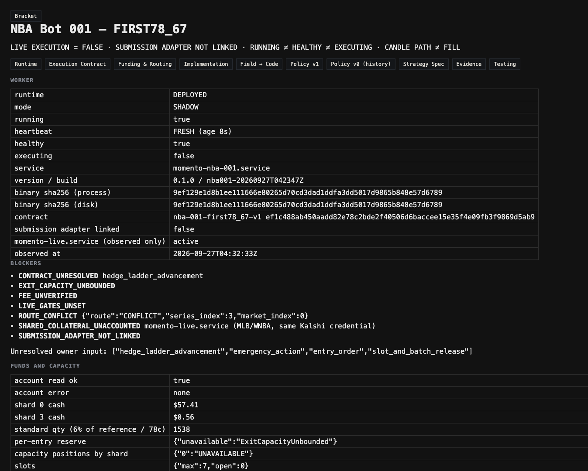

# NBA Bot 001 — deployment proof and open decisions

Snapshot 2026-09-27T04:37:05Z. Read over SSM from the host, not from
local tests.

## Supersession (2026-09-27, execution-capability phase)

Sections below this one are the Phase 1 record and are kept as written.
Where they differ, this section is current:

- `ROUTE_CONFLICT` is withdrawn. The market `exchange_index` is
  authoritative (`FUNDING_ROUTING.md`).
- `FEE_UNVERIFIED` is resolved for multiplier 1 (`FEES.md` §5).
- "Next batch = cash + open principal" is replaced by
  `strategy/EQUITY_AND_BATCH_SIZING.md` (proposal).
- The four-decision list is replaced by
  `strategy/EXECUTION_CONTRACT_PROPOSAL_V2.md` (six fields).

**Host (read 2026-09-27 over SSM):**
- `momento-nba-001.service` is active in SHADOW with build
  `nba001-20260927T042347Z` (binary `9ef129e1…`); status.json was 7 s old.
- `momento-live.service` is active; MLB binary `66ca5420…` unchanged.
- The fallback `/usr/local/bin/momento-nba-001.9ef129e1.bak` is present.

**Adapter build, not deployed:**
- Build `nba001-20260927T073448Z` (binary `496620dd…0438`) was built on
  the throwaway ARM64 builder.
- The strategy, worker, and network-replay suites all passed there.
- `--version` prints `production_orders_compiled=false`.
- It is not on the host, because the production-host exception covers a
  build without the order adapter.

Demo exercise on `external-api.demo.kalshi.co` (demo credentials, demo
funds; no production order):

| Run | Build | Pass / fail | Finding |
| --- | --- | --- | --- |
| 1–2 | 065838Z, 070645Z | — | amend response carries no counts; GET lags about 1 s; 409 after cancel |
| 3 | 070932Z | 6 / 0 | a stale read after the amend booked a phantom fill; the check then missed it |
| 4 | 071343Z | 5 / 1 | phantom fill fixed (booked 0 = venue 0); lane picked a market from stale metadata |
| 5 | 071554Z | 5 / 0 | demo book levels are fractional; the parser dropped them |
| 6 | 071828Z | 7 / 0 | taker round trip: fees 167cc and 164cc = model |
| 7 | 072129Z | 4 / 2 | demo HTTP 500s; the adapter failed closed on each |
| 8–10 | 072552Z, 073047Z, 073448Z | 7 / 0 each | clean |

Exercised on demo: post-only rest, amend (stable id), amend down,
duplicate client id (409, no second order), cancel and re-cancel, a
crossing post-only reject, reduce-only without a position, restart
reconcile from a persisted SENDING record, GTC expiry, taker buy and
reduce-only sell with fee check, and a lane entry at 78 with rest and
cancel. Timeout, late fill during cancel, and partial hedge then emergency
stay fixture-only, because demo cannot produce them on demand.

GET-only host evidence (one-off temporary copy, deleted afterwards):
tier `basic`, subaccount 0 only, netting off, auto-rebalancing off, and 235
fills compared (`FEES.md` §5). `non_get_sent=false`, `funds_moved=false`.

The throwaway builder `i-04840b005e39c12c4` is terminated. Its role and
instance profile `momento-nba001-builder-ec2` are deleted; the shared
security group `momento-paper-sg` is kept. Build artifacts remain under
`s3://momento-paper-artifacts-895492487332/m10/nba-001/build/`.

## Scope of this proof (corrected 2026-09-27)

This proof covers the read-only / SHADOW deployment phase only. It is
not proof of a working execution bot.

- The production worker is deployed and collecting.
- The desk is operational.
- The submission adapter is absent from this deployed build.
- Execution implementation and validation are incomplete.
- Funding alone will not activate trading. Depositing to the account
  changes a balance reading and nothing else.

The deployed read-only build (`9ef129e1…6789`) is kept as the working
fallback. The "open decisions" section below is superseded by
`strategy/EXECUTION_CONTRACT_PROPOSAL_V2.md`. Its first proposals were
not approved.

```text
LIVE EXECUTION = FALSE
SUBMISSION ADAPTER NOT LINKED
RUNNING ≠ HEALTHY ≠ EXECUTING
NO FUNDS MOVED · NO ORDER SENT
```

## Host and service

| Item | Value |
| --- | --- |
| Instance | `i-0f0849d5829476c31` (us-east-1, t4g.nano, AL2023 arm64) |
| Service | `momento-nba-001.service`, active since 2026-09-27 04:30:09 UTC, PID 1619966, NRestarts 0 |
| Memory | ~1.3 MB current, 96 MB max |
| Binary | `/usr/local/bin/momento-nba-001` `9ef129e1d8b1ee111666e80265d70cd3dad1ddfa3dd5017d9865b848e57d6789` |
| Version | `momento-nba-001 0.1.0 build=nba001-20260927T042347Z submission_adapter_linked=false` |
| Contract | `/etc/momento/nba-001/execution_contract.json` `ef1c488a…d5ab9` (4 unresolved) |
| Mode | `SHADOW` (config `shadow`, live gates unset) |
| Rollback copy | `/usr/local/bin/momento-nba-001.9ef129e1.bak` |
| MLB | `momento-live.service` active, PID 1581193, binary `66ca5420…`, identical before and after both installs |

## Heartbeat and logs

```text
2026-09-27T04:36:11Z momento-nba-001 heartbeat mode=SHADOW games=3 feed_age_s=60 account_ok=true shard0_cents=5741 shard3_cents=56 blockers=7 submits=false submission_adapter_linked=false
```

`status.json` heartbeat age ≤ 15 s on every read. Discovery cycle
confirmed (`feed_age_s` 240 → 0). Journal events: `WORKER_START`,
`EVENT_DISCOVERED` × 3, `ACCOUNT_OBSERVED`. No intent, order, or fill
events.

## Routing evidence (redacted)

From `momento-nba-001 probe` on the host (`funds_moved:false`,
`non_get_sent:false`). Details: `FUNDING_ROUTING.md`.

- Series `KXNBAGAME`: `exchange_index` 3, `quadratic_with_maker_fees`, multiplier 1.
- Listed events (Oct 20 BOS–DET, OKC–SAS, PHI–NYK): event and market index 0.
- Result: `ROUTE_CONFLICT`. October 3: `UNAVAILABLE`.
- Cash: shard 0 5741¢, shard 3 56¢, shards 1–2 0¢. Shared with MLB.

## Rendered desk

`http://127.0.0.1:5190/#/execution/nba` (runtime tab), local API
reading the host over read-only SSM:
DEPLOYED · SHADOW · running · FRESH · healthy · executing false ·
process sha = disk sha · seven blockers · four unresolved inputs ·
shard cash · 1538 standard qty · reserve `ExitCapacityUnbounded` ·
slots 0/7 · games 3 · placeholders with no approval or probability.



## Operate

```text
# stop (worker exits 78; systemd does not restart it)
echo '{"full_stop": true}' | sudo tee /var/lib/momento/nba-001/controls.json
# or
sudo systemctl stop momento-nba-001

# roll back to the previous binary
sudo cp -a /usr/local/bin/momento-nba-001.9ef129e1.bak /usr/local/bin/momento-nba-001.new
sudo mv -f /usr/local/bin/momento-nba-001.new /usr/local/bin/momento-nba-001
sudo systemctl restart momento-nba-001

# remove entirely
sudo systemctl disable --now momento-nba-001
```

None of these touch `momento-live.service`.

## Open decisions: first proposals (superseded, not approved)

The owner rejected these proposals as written. Among the reasons: the
first stop ignores a gap, a stale feed silently holds, the 25¢ floor
is an unauthorized loss policy, and the emergency sale does not
reconcile hedge fills first. See
`strategy/EXECUTION_CONTRACT_PROPOSAL_V2.md`. They are kept here as
history.

These were proposals for the owner. None is written into
`execution_contract.json`, and none is active. Numbers use the standard
entry: 1538 contracts at 78¢. Fee bounds use the quadratic schedule at
multiplier 1: 1848¢ at 78¢, and 2665¢ at 45¢ or 55¢.

### 1. Hedge ladder advancement and cadence

Proposed:

- At the first close at or below 67, post a limit buy of the opponent's
  YES at 33¢ for the unhedged quantity (filled YES minus filled opponent
  YES).
- On each later one-minute close, set the target to
  `100 − max(55, min(close, 67))`. Reprice only when the target rises.
  The limit never moves down, and the cap is 45¢.
- Reprice by cancel, then confirmed cancel, then new order. Do not
  replace before the cancel is confirmed, so nothing can over-hedge.
- If there is no fresh close or clock for 3 minutes, freeze the ladder
  and go to `RECONCILIATION_HOLD`. Do not advance blind.
- The time in force is good-till-cancelled. The order may take liquidity
  if it is marketable, and the fee reserve already assumes the 45¢ bound.

### 2. Emergency action and worst-price bound

Proposed option A (recommended):

- The emergency action is a reduce-only immediate-or-cancel sell of the
  unhedged original YES remainder.
- It fires on the first close below 55. First cancel any resting hedge
  and confirm the cancel.
- The sell limit is the last close minus 5¢. Re-issue it on each close
  until the position is flat.
- The worst-price floor is 25¢. Below 25¢, stop selling and hold to
  settlement; the loss is capped at principal, which is already reserved.
- Hedged pairs stay locked to settlement.
- A sell adds no cash obligation, so the emergency bound for the reserve
  is 0. The reserve becomes
  `119,964 + 1848 + 1538×45 + 2665 = 193,687¢`, which clears
  `EXIT_CAPACITY_UNBOUNDED`.

Option B:

- Buy the opponent's YES up to 55¢.
- Reserve `119,964 + 1848 + 1538×55 + 2665 = 209,067¢`.

At the $5,000 funded target (500,000¢), either option admits 2 standard
entries. At today's shard 0 cash (5741¢), it admits 0.

### 3. Entry price, time in force, expiry, and partial fills

Proposed:

- Place a post-only limit buy of YES at 78¢ for the sized quantity,
  after the qualifying close.
- Expire it on the client side by cancelling at the earliest of:
  - 3 minute closes after posting;
  - a close at or above 85 (top-out);
  - a close at or below 67;
  - the end of Q3.
- Use an exchange-side expiration only after the adapter verifies it
  against the documentation.
- Keep any partial fill as the position. Do not top it up, re-enter, or
  resize it. The hedge quantity follows the filled amount.
- Release the reserve for the unfilled remainder only after the cancel
  is confirmed and reconciled.
- One entry per game, even when an order expires with no fill.

### 4. Slot release and batch completion

Proposed:

- A filled position releases its slot after all of these:
  - `SETTLED` is observed in the settlements API;
  - `CASH_AVAILABLE` is confirmed by the balance API;
  - the reconciled position is 0;
  - the game has no resting orders.
- A position that the emergency sell took flat releases its slot once
  the sell fills are reconciled and the balance confirms the cash.
- An entry with no fill releases its slot on a confirmed cancel.
- An outcome-neutral position (hedge complete) never releases a slot
  early.
- A trade counts toward the batch of 10 when its slot is released and
  its filled quantity is greater than 0.
- `BATCH_COMPLETED` happens at the tenth counted release. The next
  admission uses cash plus open principal from that moment. Open
  positions are not resized.
- Poll settlements every 5 minutes after the game's final status.

## Also blocking, beyond the four decisions

- `FEE_UNVERIFIED`: confirm the maker-fee formula for
  `quadratic_with_maker_fees` from Kalshi documentation.
- `ROUTE_CONFLICT`: series 3 against market 0. Decide whether the
  per-market index is the authority. Fund only the shard of the market
  actually traded.
- `SHARED_COLLATERAL_UNACCOUNTED`: choose verified isolation (a separate
  subaccount or shard) or a shared reservation ledger respected by
  `momento-live.service`.
- `SUBMISSION_ADAPTER_NOT_LINKED`: this needs its own reviewed change
  after the items above.
